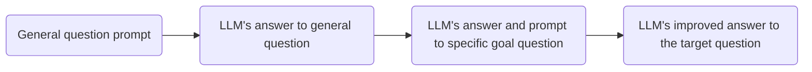
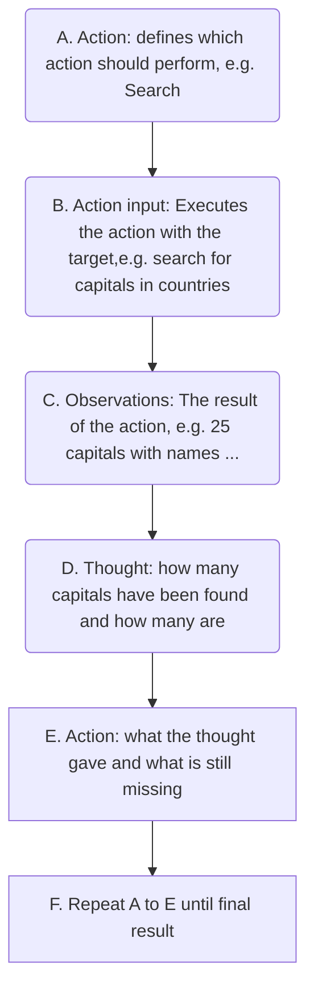

# References:
- https://www.kaggle.com/whitepaper-prompt-engineering

# Introduction:
This notebooks aims to extend and deepened the introduction to prompt engineering presented in the notebook **LLM fine tuning** ( #prompt_engineering ). 

When prompt engineering you need to consider that you prompt might required to be adjusted to the model you have selected. It means, prompts need to be optimized for the model, Gemini, Cluade, GPT. In addition to the prompt, you need to tinker with the various configurations of a LLM.

# LLM Configuration
Once you have selected the model you will use, you need to identify the model configuration options, these options control the LLM outputs. Some common configuration options are:

## Output length:
This sets the number of tokens to generate in a response. This setting is especially important for some LLM prompting techniques such as **ReAct** ( #react), where the LLM will keep emitting useless tokens after the response you want.

## Sampling Controls:
Remember that LLM predicts tokens and its associated probability to what would be the most likely next token. The selection of the next token among these predictions can be controlled. For example, by defining the **temperature**, **top-K**, and **top-p**.

As a general starting point you can consider

| temperature| top-p| top-k | outcome|
|---|---|---|---|
|0.2|0.95|30|creative-coherent|
|0.9|0.99|40|highly-creative|
|0.1|0.9|20|low-creative|
|0|~|~|math-problems|
|---|---|---|---|

in the above table, "math-problems" refers to problems that have only one single correct answer, by selecting temperature=0, this turns into a greedy search and the other variables become irrelevant, denoted by "~".

# Prompt records
Your prompts will likely go through many iterations before they end up in a codebase, for this reason it is important to keep a record of your prompts. One example of prompt documentation is provided in the table below

| Name            | value                                                                  |
| --------------- | ---------------------------------------------------------------------- |
| 1_1_movie_class | None                                                                   |
| Goal            | classify movie reviews as positive, negative, or neutral               |
| Model           | gemini-pro                                                             |
| Temperature     | 0.1                                                                    |
| Token limit     | 5                                                                      |
| Top-K           | 0.1                                                                    |
| Top-p           | 1                                                                      |
| prompt          | Classify movie reviews as positive, negative, or neutral. Review "..." |
| Output          | Positive                                                               |

In the example above "Output" refers to the output obtained from the LLM with this prompt configuration.

# System, contextual and role prompting
These are techniques used to guide how LLMs generate text, but they focus on different aspects:

- **System prompting:** Defines the overall context, "the big picture" of what is the role of the LLM, for example, translating language, classifying a review, etc.
- **Contextual prompting:** provides specific details or background information relevant to the "big picture" task. Give nuances about the task to be done.
- **Role prompting:** assigns a specific character or identity for the language model to adopt.

Let's consider some examples using the same table record presented before but changing the prompt.

- *System prompting example:*
```
Classify movie reviews as positive, negative or negative. Only return the label in uppercase.
```
In this example I am telling to the LLLM that its general purpose is to classify movie reviews into three different categories.
- *Contextual prompting example:*
```
Classify movie reviews as positive, negative or negative. Pay attention to movie reviews that use specific bad words and give more weight to it. Only return the label in uppercase.
```
- *Role prompting example:*
```
Classify movie reviews as positive, negative or negative. Pay attention to movie reviews that use specific bad words and give more weight to it. Additionally, you will act as a recognized reviewer which reviews are taking into account by the general public and the most recognized award academies. Only return the label in uppercase.
```

# Step-back prompting
This technique consist in prompting the LLM to first consider a general question related to the specific task at hand, and then feeding the answer to that general question into a subsequent prompt for the specific task.



Let's consider two examples, without and with step-back prompting
*Without*
```
Write a one paragraph storyline for a new level of a first person shooter video game that is challenging and engaging.
```
*With*
```
Based on popular first-person shooter action games, what are the 5 fictional key settings that contribute to a challenging and engaging level storyline in a first-person shoter video game?
```
In the next iteration we create a new prompt using the answer of the LLM to this general question
```
context: 5 engaging themes for a first person shooter video game: <<LLM's answer from previous prompt>>.
Take one of the themes and write a one paragraph storyline for a new level of a fisrt-person shooter video game that is challenging and engaging.
```

# Chain of Thought (CoT)
Among the advantages of this technique are:
- low effort and works well with off-the-shelf LLM (no need of finetune)
- interpretability of the answer, as you can see the reasoning steps
- improve robustness when moving between different LLM versions.

One disadvantage of this technique is related to the inclusion of the reasoning chain, therefore, increasing the number of used tokens.
*Example:*
```
When I was 3 years old, my partner was 3 times my age. Now, I am 20 years old. How old is my partner? let's think step by step.
```
The whole **CoT** is triggered by the addition to the prompt of **"Let's think step by step"**. You can try and prompt the two versions (with and without this addition) and see the differences. 

# Three of thought (ToT)
ToT generalizes the concept of CoT because it allows LLMs to explore multiple different reasoning paths simultaneously, rather than just following a single linear chain of thought. This approach is particularly useful for *complex tasks that require exploration* 

# Reason and Act (ReAct)
#react 
ReAct is a **paradigm** for enabling LLMs to solve complex tasks using natural language reasoning *combined with external tools*. This technique allows LLM to perform certain actions, such as *interacting with external APIs* to retrieve information which is a first step towards *agent modeling*.

**Overview:** ReAct mimics how humans operate in the real world, as we reason verbally and take actions to gain information. ReAct works by combining **reasoning** and **acting** into a **thought-action loop**.  The LLM first reasons about the problem and generates a plan of action. it then performs the actions in the plan and observes the results. The LLM then uses the observations to update its reasoning and generate a new plan of action. This process continues until the LLM reaches a solution to the problem.


# Automatic Prompt Engineering (APE)
#APE 
By using this method not only alleviates the need for human input but also *enhances* the model's performance in various tasks. The **general idea** is that you will prompt a model to generate more prompts, evaluate them, improve them and repeat.

Let's consider an example:
**Goal:** Train a chatbox for a merchandise t-shirt webshop. Target to the multiple ways a customer could phrase their order for *buying* a band t-shirt.

*Prompt:*
```
We have a band merchandise t-shirt webshop, and to train a chatbox we need various ways to order: "one Metallica t-shirt, sie S". Generate 10 variants, with the same semantics but keeping the same meaning.
```

**Define metric:** Once you have the answer from the LLM to your prompt you need to define a metric to assess which answers are closer to your goal. For example you can use **BLEU** (billingual evaluation understudy) or **ROUGE** (recall-oriented understudy for Gisting evaluation).

**Decide:** After you have your metric performance on the answers, select the best answers given that metric. These candidates could either go through another refinement procedure or used to your goal.

# Best practices

- Provide examples(one/ few shot)
- Design with simplicity: concise, clear and easy to understand. If it is not clear for you, it won't be clear for the LLM
- Specific about the output
- Use instructions over constraints: explicit instructions on the desired format, style and content of the response. -> *Positive instructions*
- Control the max token length
- Use variables in the prompt: this allows you to reuse prompts and make them more dynamic
```
{city} = "Medellin"
PROMPT:
You are a travel guide. Tell me a fact about the city: {city}
```
- Adapt to model updates: keep up to date of newer models and adapt your prompts to them.
- Consider different output formats: For example, for non-creative tasks considered structured forma like JSON or XML. Consider using **JSON repair** library (available on PyPl), this helps to reconstruct and repair broken json formats that the model might output.

# Working with schemas

A JSON schema defines the expected structure and data types the LLM should expect in the prompt. Helping the model to focus on relevant information and reducing tokens usage. ==For example, by preprocessing the data of a company and formatting it into a JSON format instead of providing full documents you give the LLM a clear understanding of the data's attributes== 
An example of a schema definition is provided below
```
{
"type": "object",
"properties": {
				"name": {"type":"string","description":"prod"},
				"cateogry": {"type":"string","descriptions":},
				"price" : ...
				}
}
```
Once you have defined the schema you can provide the actual product using that schema, for example:
```
{
"name": "headphones"
"category": "Electronics",
"price": 99,
...
}
```
